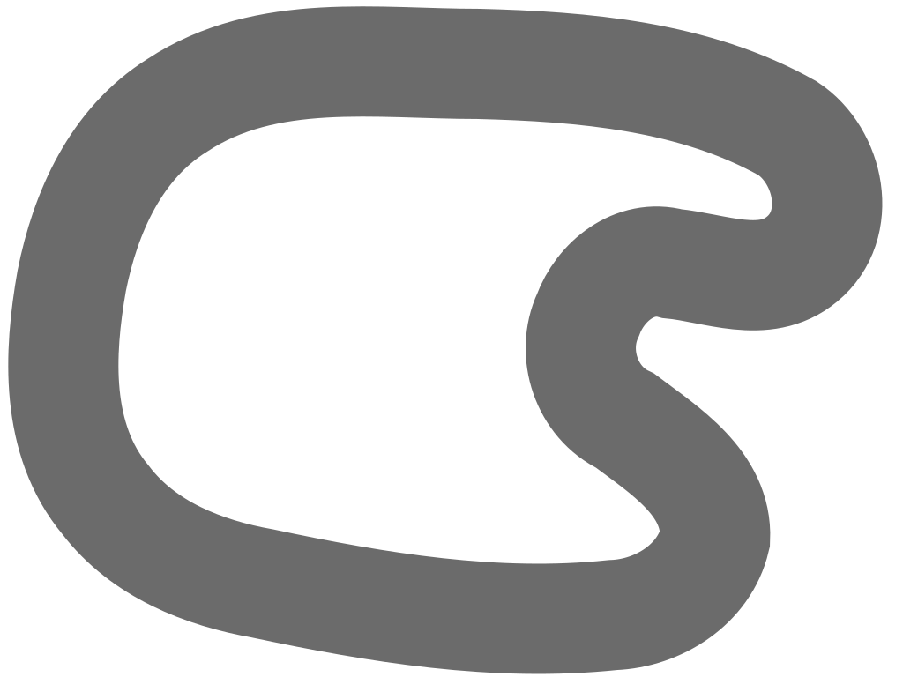

# AI Driving Game

A browser-based, top-down self-driving car simulation powered by neuroevolution. A population of AI cars learns to navigate a looped racetrack through a human-in-the-loop evolutionary process — you watch, you pick the winner, and the next generation adapts.

---

## Demo



---

## How It Works

### Neuroevolution (NEAT)

Each car is controlled by a small neural network evolved using the [NEAT](https://nn.cs.utexas.edu/downloads/papers/stanley.ec02.pdf) (NeuroEvolution of Augmenting Topologies) algorithm via [Neataptic](https://wagenaartje.github.io/neataptic/).

- **Population**: 100 AI cars per generation
- **Inputs**: 3 rangefinder sensors (left, center, right at ±45°)
- **Output**: 1 steering value (0 = full left, 1 = full right)
- **Elitism**: Top 30% of the population is preserved each generation
- **Mutation rate**: 10%, with the full suite of NEAT topology mutations

### Sensor System (FOV)

Each car fires 3 raycasts from its nose at **-45°, 0°, and +45°**. Each ray travels up to 200 units and returns a normalized distance `[0–1]` to the nearest road boundary (inner or outer). These three values are the direct inputs to the neural network every frame.

```
         car
          |
   \      |      /
    \     |     /
  left  center  right
  (-45°)  (0°)  (+45°)
```

### Evolution Loop

There is no automated fitness function. You watch the simulation and manually select the best-performing car:

1. Click a car on the canvas to select it
2. Watch which car travels the farthest without crashing
3. Click **Re-Train** to promote that car's brain as the elite and breed the next generation
4. Repeat

---

## Getting Started

### Prerequisites

- [Node.js](https://nodejs.org/) v18+
- npm v9+

### Install

```bash
git clone https://github.com/your-username/ai-driving-game.git
cd ai-driving-game
npm install
```

### Run

```bash
npm start
```

Then open [http://localhost:8080](http://localhost:8080) in your browser.

---

## Controls

| Input | Action |
|---|---|
| Click a car | Select it for graph visualization and Re-Train targeting |
| Arrow Up | Accelerate manual car |
| Arrow Down | Brake manual car |
| Arrow Left | Steer manual car left |
| Arrow Right | Steer manual car right |
| Spacebar | Reset manual car to start |

> One extra car (blue) is always manually drivable alongside the AI population.

---

## UI Panel

| Button | Description |
|---|---|
| **Re-Train** | Promotes the selected car's brain, breeds offspring, mutates the new generation, and resets all cars |
| **Save Population** | Downloads the current NEAT population as `carPopulation.json` |
| **Load Population** | Loads a previously saved `carPopulation.json` to resume training |

---

## Project Structure

```
ai-driving-game/
├── src/
│   ├── index.js        # Entry point — wires canvas, controls, and engine
│   ├── engine.js       # Game loop, population management, keyboard input
│   ├── car.js          # Car entity: physics, steering, collision, rendering
│   ├── ai.js           # NEAT population setup (3 inputs, 1 output, 100 cars)
│   ├── fov.js          # Raycast sensor system (3 rays at -45°, 0°, +45°)
│   ├── road.js         # SVG track loader, extracts inner/outer boundaries
│   ├── graph.js        # D3 + WebCola neural network visualizer
│   ├── controls.js     # React sidebar (Re-Train, Save, Load)
│   ├── keyboard.js     # Keyboard event abstraction
│   └── index.html      # App shell
├── images/
│   ├── main_track.svg            # Track visual reference
│   └── main_track-split.svg     # Track with separate inner/outer boundary paths
├── webpack.config.js   # Webpack 5 build config
├── eslint.config.js    # ESLint 9 flat config
└── package.json
```

---

## Tech Stack

| Layer | Technology |
|---|---|
| Rendering & geometry | [Paper.js](http://paperjs.org/) — canvas 2D, vector paths, raycasting, collision |
| AI / neuroevolution | [Neataptic](https://wagenaartje.github.io/neataptic/) — NEAT algorithm |
| UI | [React](https://react.dev/) — sidebar controls |
| Neural net visualization | [D3.js](https://d3js.org/) + [WebCola](https://ialab.it.monash.edu/webcola/) |
| Bundler | [Webpack 5](https://webpack.js.org/) + webpack-dev-server |
| Transpiler | [Babel](https://babeljs.io/) (preset-env + preset-react) |
| Linting | [ESLint 9](https://eslint.org/) flat config |

---

## Architecture Notes

- **SVG-based track with dual boundaries**: The road is stored as an SVG with two separate closed paths (inner ring and outer ring). Paper.js uses the same vector geometry for both rendering and intersection math, so FOV raycasting and collision detection work off identical data.
- **React for UI, Paper.js for game**: Concerns are cleanly separated. Communication between the sidebar and the game engine goes through the `Engine` object reference passed into the React component.
- **Population persistence**: The full NEAT population serializes to JSON, so training can be paused and resumed across sessions via Save/Load.
- **No automated fitness**: Fitness is implicit and human-guided. The user decides which car performed best each generation.
